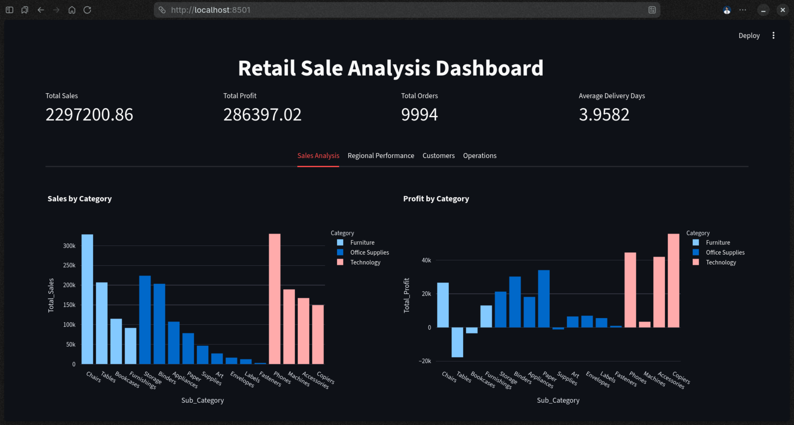
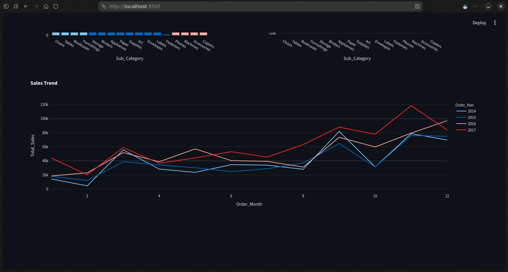
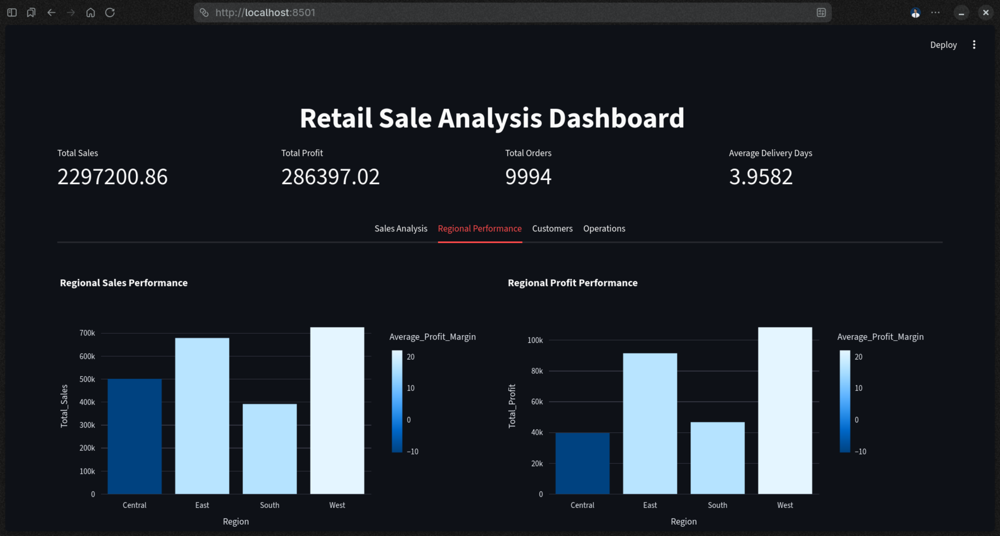
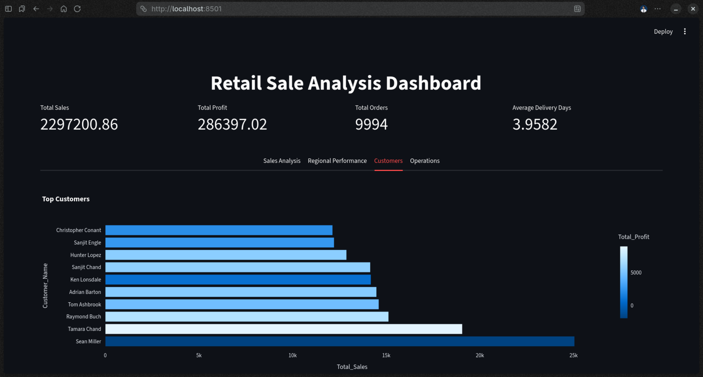
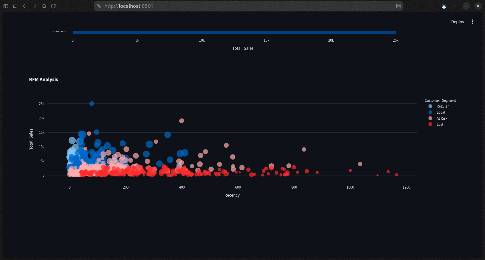
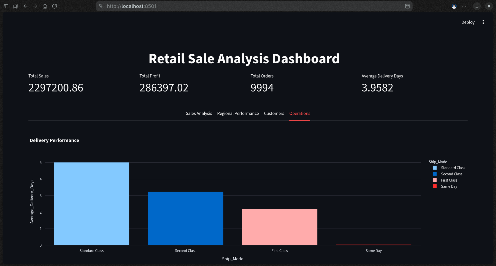

# Retail-Sales-Analysis

Project for Retail Sales Analysis using MySQL for ETL and Python for data analysis, deployed with an interactive Streamlit dashboard.

---

## Project Overview

This project analyzes retail sales data from the Superstore dataset. The purpose is to explore business insights across sales, profit, customer behavior, and delivery performance using SQL and an interactive Python dashboard.

---

## Tools

- **MySQL** — data storage, ETL, feature engineering, analytical views

- **Python** — data loading and dashboard

- **Streamlit** — interactive dashboard

- **Plotly** — data visualizations

- **SQLAlchemy + PyMySQL** — database connection

- **Pandas** — data handling

---

## Project Structure

```bash
Retail-Sales-Analysis/
├── data/
├── sql/
│   ├── transform.sql
│   ├── extract.sql
│   └── view.sql
├── app.py
├── utils.py
├── charts.py
├── db.py
├── requirements.txt
└── .env
```

---

## Dataset

- **Source:** Kaggle Superstore Dataset
- **Link:** https://www.kaggle.com/datasets/vivek468/superstore-dataset-final
- **Size:** ~10,000 rows, 21 columns

---

## ETL Procedure

1. Raw CSV loaded into MySQL via Python/SQLAlchemy

2. Column renaming and type fixes (`transform.sql`)

3. Feature engineering (`extract.sql`):
   
   - Delivery Days
   
   - Profit Margin %
   
   - Order Year, Month, Quarter
   
   - Discount Impact Flag
   
   - Revenue Band

---

## SQL Views

| View                       | Description                                 |
| -------------------------- | ------------------------------------------- |
| Sales_by_Category_View     | Sales & profit by category and sub-category |
| Sales_Trend_Over_Time_View | Monthly and yearly sales trend              |
| Regional_Performance_View  | Sales, profit, margin by region             |
| Top_Customers_View         | Top 10 customers by revenue                 |
| Delivery_Performance_View  | Avg/min/max delivery days by ship mode      |
| RFM_Analysis_View          | Customer segmentation using RFM scoring     |

---

## Dashboard Features

- KPI cards — Total Sales, Profit, Orders, Avg Delivery Days
- Sales Analysis — Sales & Profit by Category, Sales Trend
- Regional Performance — Sales & Profit by Region
- Customers — Top 10 Customers, RFM Scatter Plot
- Operations — Delivery Performance by Ship Mode

---

## Screenshots













---

## Setup

**1. Clone the Repository**

```bash
git clone https://github.com/Moiz-205/Retail-Sales-Analysis.git
cd Retail-Sales-Analysis
```

**2. Create virtual environment**

```bash
python -m venv .venv
source .venv/bin/activate
pip install -r requirements.txt
```

**3. Configure `.env`**

```bash
DB_USER=your_mysql_username
DB_PASSWORD=your_mysql_password
DB_HOST=localhost
DB_NAME=retail_db
```

**4. Load data into MySQL**

```bash
python db.py
```

**5. Run SQL files in order**

```sql
mysql -u root -p retail_db < sql/transform.sql
mysql -u root -p retail_db < sql/extract.sql
mysql -u root -p retail_db < sql/view.sql
```

**6. Run the dashboard**

```bash
streamlit run app.py
```

## License

This project is licensed under the [GNU General Public License v3.0](https://www.gnu.org/licenses/gpl-3.0.en.html).
